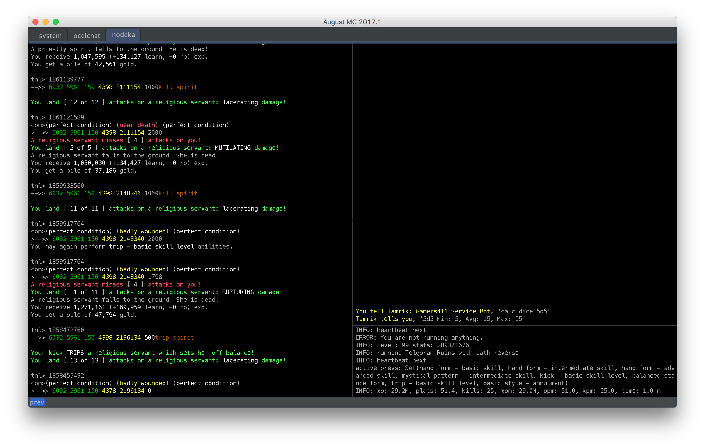
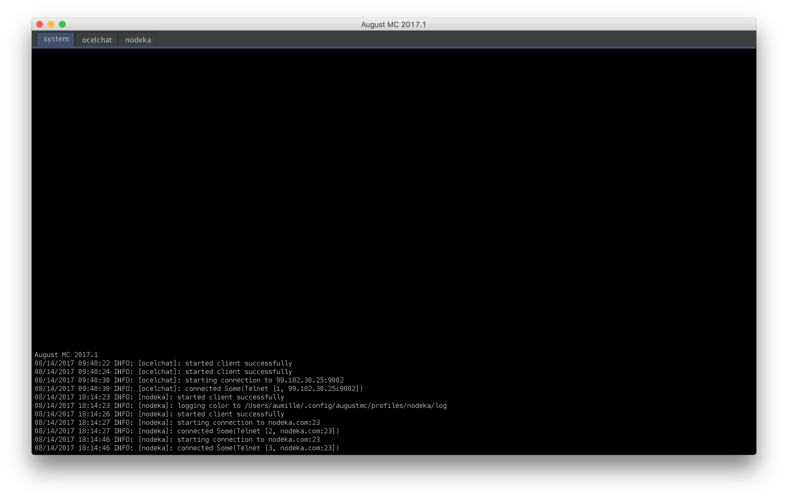
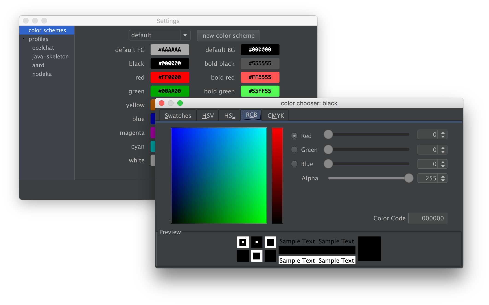
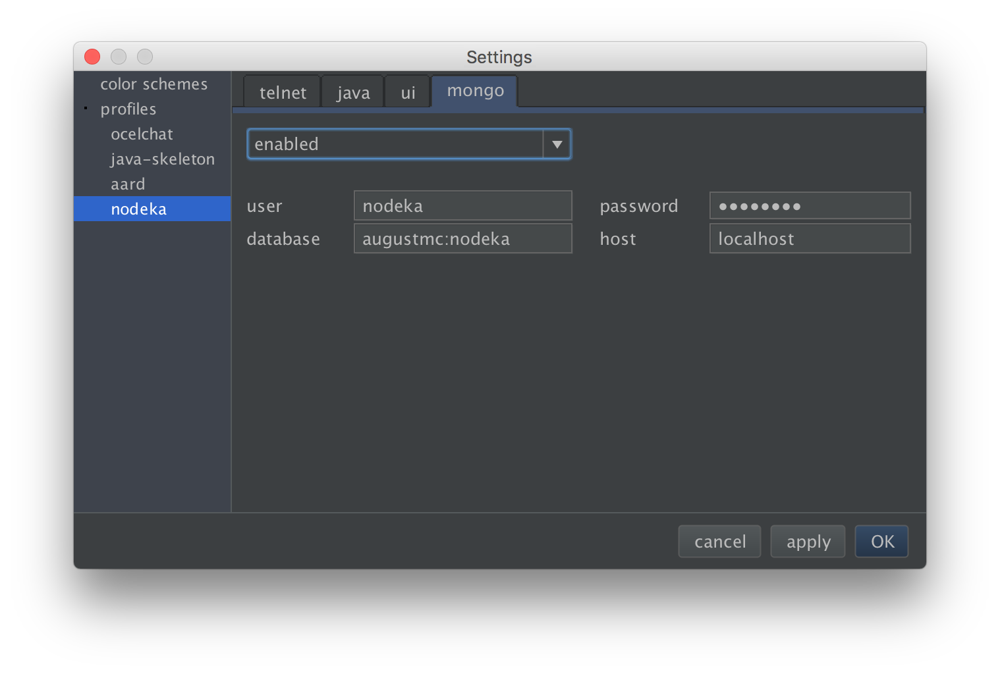

# August MC

August Mud Client is a modern mud client written in Scala that allows scripting in 
any JVM-based language (Java, Scala, Kotlin, Clojure, etc).  The focus for the client
is to provide a clean interface and excellently written composable components and
turn over the control to the user via the scripting framework.

On first launch, August MC looks quite plain.  As users discover how programmable it
is, it empowers them to create a complex UI with complete insight into the application
and socket events, as well as the ability to code whatever they like using Java's
vast library.

## Features

* JVM-based scripting
* Classloader Isolation
* GMCP
* MCCP
* programmable window layout
* IntelliJ's Darcula theme
* first class MongoDB integration
* perfect text processing
* customizable telnet color
* scroll splitter
* a powerful framework
* color triggers
* auto-logging (also with color)

## Docs

* [Getting Started](docs/getting-started.md)
* [Clients](docs/clients.md)
* [Client Quick Start](docs/client-quick-start.md)
* [Reloader](docs/reloader.md)
* [Scheduler](docs/scheduler.md)
* [Contributing](docs/contributing.md)
* [FAQ](docs/faq.md)

## Screenshots

## Credits

* Konstantin Bulenkov for our most excellent [Darcula LookAndFeel](https://github.com/bulenkov/Darcula)
* [Aardwolf](http://aardmud.org) for playing test server
